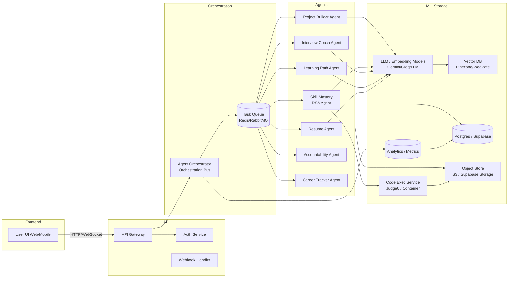

# 🚀 StudyMate Platform 2.0 - Complete Agentic Upgrade Plan

**Strategic Vision & Technical Blueprint** | Version 2.0  
**Created:** January 2025  
**Status:** Planning Phase → Ready for Implementation

---

## 📋 Table of Contents

1. [Executive Summary](#executive-summary)
2. [Current State Analysis](#current-state-analysis)
3. [Vision: Agentic Career Accelerator](#vision-agentic-career-accelerator)
4. [Core Agents Architecture](#core-agents-architecture)
5. [Market Analysis & Competitive Positioning](#market-analysis--competitive-positioning)
6. [Feature Blueprint: 6 Agentic Modules](#feature-blueprint-6-agentic-modules)
7. [High-Level System Architecture](#high-level-system-architecture)
8. [Detailed Agent Workflows](#detailed-agent-workflows)
9. [Data Model & Memory Strategy](#data-model--memory-strategy)
10. [Code Execution Environment](#code-execution-environment)
11. [Technology Stack Recommendations](#technology-stack-recommendations)
12. [Difficulty & Novelty Assessment](#difficulty--novelty-assessment)
13. [MVP Plan & Timeline](#mvp-plan--timeline)
14. [Feature-by-Feature UI/UX Flows](#feature-by-feature-uiux-flows)
15. [Implementation Patterns](#implementation-patterns)
16. [Data Privacy & Safety](#data-privacy--safety)
17. [Database Decisions](#database-decisions)
18. [Concrete Next Steps](#concrete-next-steps)
19. [Risks & Mitigation](#risks--mitigation)
20. [Final Positioning](#final-positioning)

---

## 🎯 Executive Summary

### One-Line Summary

Turn StudyMate into an **Agentic Career Accelerator**: a set of autonomous agents (Resume, Learning, Interview, Skill Mastery, Project Builder, Accountability + Career Tracker) orchestrated by an event/agent hub, backed by a relational DB + vector DB for memory/embeddings, with secure code execution (Judge0/Docker sandbox) and file storage (S3/Supabase Storage). Build an MVP that proves the agent loop: **analyze → plan → practice → feedback → adapt**.

### The Problem with Current Platform

**Current State:** StudyMate is a **good collection of features** but lacks **novelty and differentiation**.

**What We Have:**
- ✅ Resume analyzer
- ✅ Profile builder
- ✅ Course generator
- ✅ DSA sheet
- ✅ Mock interviews
- ✅ Emotion detection

**The Issue:** This combination is **not rare anymore**. Competitors have similar features:
- CodingNinjas: Course + Interview
- LeetCode: DSA + Interview
- Exponent: Interview + Profile help
- Coursera: Courses
- Resume.io: Resume + ATS checks
- Interviewing.io: Mock interviews

**Current Platform = "Good collection of features" BUT NOT A NOVEL PRODUCT.**

### The New Vision: Agentic Career Accelerator

**Core Philosophy Shift:**

❌ **NOT:** "Here are features. Click what you want."  
✅ **INSTEAD:** "Here is your AI agent who runs your entire preparation journey."

**Novelty Statement:**
> *"My platform becomes your personal career agent — not a collection of tools."*

**This is where all competitors fail. This is your angle.**

---

## 🔍 Current State Analysis

### What We Have Built (95% Complete)

#### ✅ Fully Operational Services

1. **API Gateway** (Port 8000) - ✅ Complete
   - JWT authentication
   - Request routing
   - Health monitoring

2. **Resume Analyzer** (Port 8003) - ✅ Complete
   - PDF/DOCX parsing
   - AI analysis (Groq + Gemini)
   - Job matching
   - Score calculation (5 dimensions)

3. **Profile Service** (Port 8006) - ✅ Complete
   - Resume upload
   - AI data extraction
   - Profile CRUD operations

4. **Course Generation** (Port 8008) - ✅ Complete
   - Parallel generation (~40 seconds)
   - Chapters, quizzes, flashcards
   - Audio scripts
   - Word games, articles

5. **Interview Coach** (Port 8002) - ✅ Complete
   - Technical/Aptitude/HR interviews
   - Real-time feedback
   - Audio transcription
   - Emotion detection integration

6. **Emotion Detection** (Port 8005) - ✅ Complete
   - Real-time facial analysis
   - 7 emotion categories
   - WebSocket support

#### ⚠️ Partially Complete

- **DSA Service** (Port 8004) - 60% complete (Frontend done, backend needs work)

### Current Architecture Strengths

✅ **Microservices Architecture** - Scalable and maintainable  
✅ **AI Integration** - Multiple AI models (Groq, Gemini, Custom ViT)  
✅ **Real-time Features** - WebSocket support, live emotion detection  
✅ **Modern Stack** - React, TypeScript, FastAPI, Supabase  
✅ **Production Ready** - Error handling, logging, health checks

### Current Architecture Gaps

❌ **No Agentic Orchestration** - Services work independently  
❌ **No Continuous Learning** - Static content, no adaptation  
❌ **No Progress Intelligence** - Basic tracking, no predictive analytics  
❌ **No Cross-Service Intelligence** - Services don't communicate insights  
❌ **No Personalized Adaptation** - Same experience for all users

---

## 🧠 Vision: Agentic Career Accelerator

### Core Principle

Transform from **"Tool Collection"** → **"Intelligent Agent Ecosystem"**

### The 5 Core Agents

#### 1. **Resume Agent** 🤖

**Current:** Resume analyzer (static analysis)  
**Upgrade:** Intelligent agent that:
- Reads resume → improves it → builds profile → extracts gaps → connects to job roles
- **Continuously monitors** resume effectiveness
- **Suggests improvements** based on job market trends
- **Auto-updates** profile when new skills are learned

#### 2. **Learning Path Agent** 🎓

**Current:** Course generator (static courses)  
**Upgrade:** Dynamic learning orchestrator that:
- Generates courses based on profile + goals + skill gaps
- Creates DSA roadmap
- Creates tech roadmap
- **Updates every week** based on progress
- **Recommends new topics** automatically
- **Adapts difficulty** based on performance

#### 3. **Interview Coach Agent** 💼

**Current:** Mock interview (static questions)  
**Upgrade:** Adaptive interview mentor that:
- **Adapts questions** to weak areas
- **Tracks progress** across sessions
- **Gives behavioral feedback** (tone, structure, STAR)
- **Analyzes emotion + tone** in real-time
- **Schedules mock interviews** automatically
- **Builds interview readiness score** daily

#### 4. **Skill Mastery Agent** 🎯

**Current:** DSA sheet (basic problem list)  
**Upgrade:** Intelligent skill evaluator that:
- **Evaluates thinking** from coding submissions
- **Finds missing patterns** (graphs? DP? recursion?)
- **Gives personalized assignments**
- **Grades solutions** with detailed feedback
- **Pushes custom challenges**
- **Teaches patterns** instead of just giving answers

#### 5. **Accountability Agent** 📊 (NEW - Pure Novelty)

**This is killer. None of the competitors have this.**

It:
- **Tracks daily progress** across all modules
- **Gives reminders** and notifications
- **Adjusts schedule** based on performance
- **Motivates** with personalized messages
- **Gives productivity insights**
- **Suggests what to study next**
- **Warns when falling behind**
- **Predicts time to job-readiness**

---

## 🌐 Market Analysis & Competitive Positioning

### Competitive Landscape

| Platform | Strengths | Weaknesses (Your Opportunity) |
|----------|-----------|-------------------------------|
| **LeetCode** | DSA, contests, interview mode | ❌ No AI feedback<br>❌ No resume<br>❌ No courses<br>❌ No personalization |
| **HackerRank** | Company-style problems | ❌ Trash personalization<br>❌ No guidance<br>❌ No interviews |
| **CodeChef** | Competitive programming | ❌ No career prep<br>❌ No interviews<br>❌ No AI |
| **GeeksforGeeks** | Content library | ❌ Overcrowded<br>❌ Outdated UX<br>❌ No personalization |
| **Interviewing.io** | Mock interviews | ❌ No learning path<br>❌ No resume<br>❌ No DSA |
| **CodingNinjas** | Courses | ❌ No deep personalization<br>❌ Expensive<br>❌ No emotion AI |
| **Coursera/Udemy** | Courses | ❌ No interview prep<br>❌ No resume<br>❌ No AI<br>❌ Not job-focused |

### Conclusion

**Everyone has fragments, no one has a continuous agentic journey.**

**That is your golden entry point.**

---

## 🧩 Feature Blueprint: 6 Agentic Modules

### ⭐ Module 1: User Agent Onboarding (NEW)

**User uploads:**
- Resume
- Job role
- Experience level

**Agent instantly generates:**
- ✅ **Skill graph** (visual representation)
- ✅ **Weakness map** (identified gaps)
- ✅ **Strength summary** (what you're good at)
- ✅ **Personalized 30-day plan**
- ✅ **Personalized 90-day plan**
- ✅ **Complete roadmap** (visual timeline)

**This is your novelty.**

**Technical Implementation:**
- New service: `onboarding-agent` (Port 8009)
- Integrates with: Resume Analyzer, Profile Service, Course Generation
- Uses: Groq API for analysis, Gemini for roadmap generation
- Database: New `user_onboarding` table with skill graphs, plans, roadmaps

---

### ⭐ Module 2: Agentic Course Generator 2.0 (UPGRADE)

**Current:** Static course generation  
**Upgrade:** Dynamic, adaptive course system

**New Capabilities:**
- ✅ **Dynamic course** - Changes every week based on progress
- ✅ **Adaptive difficulty** - Adjusts based on quiz performance
- ✅ **Auto-adds chapters** - When user struggles with a topic
- ✅ **Mini quizzes** - After each topic (not just chapters)
- ✅ **Auto-flashcards** - Generated from user's weak areas
- ✅ **Coding challenges** - Related to course topics
- ✅ **Progress-aware** - Skips topics user already knows

**Nothing in the market does this.**

**Technical Implementation:**
- Enhance: `course-generation` service (Port 8008)
- New features:
  - Progress tracking per topic
  - Adaptive difficulty algorithm
  - Dynamic chapter generation
  - Weak area detection
- Database: 
  - New `course_progress_detailed` table (per-topic tracking)
  - New `user_weak_areas` table
  - Update `courses` table with `is_dynamic` flag

---

### ⭐ Module 3: Agentic Interview Coach 2.0 (UPGRADE)

**Current:** Static question generation  
**Upgrade:** Adaptive interview mentor

**New Capabilities:**
- ✅ **Adaptive questions** - Based on last answer quality
- ✅ **Confidence detection** - Using emotion detection
- ✅ **Pattern tracking** - Rambling, weak examples, poor structure
- ✅ **STAR answer fixing** - Real-time feedback on structure
- ✅ **Behavioral story generation** - Creates new stories for you
- ✅ **Company-specific mocks** - Synthesizes company interviews
- ✅ **Interview Progress Score** - Daily tracking

**This becomes your killer feature.**

**Technical Implementation:**
- Enhance: `interview-coach` service (Port 8002)
- New features:
  - Answer quality analysis (using Groq)
  - Pattern detection (rambling, weak structure)
  - STAR methodology checker
  - Behavioral story generator
  - Company-specific question synthesis
- Database:
  - New `interview_patterns` table
  - New `interview_readiness_scores` table (daily tracking)
  - Update `interview_sessions` with pattern analysis

---

### ⭐ Module 4: Agentic DSA Sheet 2.0 (UPGRADE)

**Current:** Basic problem list  
**Upgrade:** Intelligent DSA mentor

**New Capabilities:**
- ✅ **Code analysis** - Analyzes user's coding submissions
- ✅ **Performance tracking** - Timestamps, time taken, attempts
- ✅ **Weak area detection** - Graphs? DP? Recursion?
- ✅ **Custom problem assignment** - Based on weak areas
- ✅ **Mistake explanation** - Detailed feedback on errors
- ✅ **Pattern teaching** - Teaches patterns, not just answers
- ✅ **Weekly practice exams** - Auto-generated

**No competitor does this.**

**Technical Implementation:**
- Complete: `dsa-service` backend (Port 8004)
- New features:
  - Code submission analysis (using Groq)
  - Pattern detection algorithm
  - Weak area identification
  - Custom problem generator
  - Pattern explanation system
- Database:
  - New `dsa_submissions` table
  - New `dsa_weak_areas` table
  - New `dsa_practice_exams` table
  - Update `dsa_problems` with pattern tags

---

### ⭐ Module 5: Agentic Project Builder (NEW)

**This is a huge novelty.**

**User selects:**
- Domain → Web/backend/ML
- Difficulty
- Goal (resume worthy? interview project?)

**Agent:**
- ✅ **Creates real-world project plan**
- ✅ **Generates tasks** (step-by-step)
- ✅ **Provides API design** (for backend projects)
- ✅ **Reviews code** (submitted code)
- ✅ **Suggests improvements**
- ✅ **Creates documentation** (auto-generated)

**LeetCode cannot do this. CodingNinjas cannot do this. Coursera cannot do this.**

**You win here.**

**Technical Implementation:**
- New service: `project-builder` (Port 8010)
- Features:
  - Project plan generation (using Gemini)
  - Task breakdown (using Groq)
  - API design generator
  - Code review (using Groq)
  - Documentation generator
- Database:
  - New `user_projects` table
  - New `project_tasks` table
  - New `project_code_reviews` table
  - New `project_documentation` table

---

### ⭐ Module 6: Agentic Career Tracker (NEW)

**A full analytics dashboard:**

- ✅ **Weekly progress score** (across all modules)
- ✅ **Interview readiness score** (0-100)
- ✅ **DSA mastery score** (0-100)
- ✅ **Soft-skill confidence score** (0-100)
- ✅ **Resume strength score** (0-100)
- ✅ **Predicts time to job-readiness** (AI-powered)

**This turns your app into an AI-powered career cockpit.**

**No one has this.**

**Technical Implementation:**
- New service: `career-tracker` (Port 8011)
- Features:
  - Aggregates data from all services
  - Calculates composite scores
  - Predictive analytics (using Groq/Gemini)
  - Visualizations (charts, graphs)
- Database:
  - New `career_scores` table (daily/weekly tracking)
  - New `career_predictions` table
  - New `career_insights` table

---

## 🏗️ High-Level System Architecture

### Architecture Diagram (Mermaid)



### Architecture Components

#### Frontend Layer
- **User UI** (Web/Mobile) - React + TypeScript + Vite
- WebRTC for live sessions
- WebSocket for real-time updates

#### API Layer
- **API Gateway** - Central entry point
- **Auth Service** - JWT authentication
- **Webhook Handler** - External integrations

#### Orchestration Layer
- **Agent Orchestrator** - Coordinates all agents
- **Task Queue** - Redis/RabbitMQ for async jobs
- **Event Bus** - Agent communication

#### Agent Layer
- **Resume Agent** - Resume analysis & improvement
- **Learning Path Agent** - Course generation & adaptation
- **Interview Coach Agent** - Mock interviews & feedback
- **Skill Mastery Agent** - DSA practice & code analysis
- **Project Builder Agent** - Project generation & code review
- **Accountability Agent** - Progress tracking & motivation
- **Career Tracker Agent** - Analytics & predictions

#### ML & Storage Layer
- **LLM Models** - Gemini, Groq, Custom models
- **Vector DB** - Pinecone/Weaviate for embeddings
- **PostgreSQL** - Supabase for relational data
- **Object Storage** - S3/Supabase Storage for files
- **Code Execution** - Judge0/Docker for code running
- **Analytics** - Metrics & monitoring

---

## 🔄 Detailed Agent Workflows

### 2.1 User Agent Onboarding (Entry Point)

#### User Journey

1. User signs up or logs in
2. Uploads resume and GitHub link (optional)
3. Picks target role(s)
4. Selects time availability
5. Agent runs quick scan:
   - Resume parse + profile extract
   - Returns profile summary (skills, experience, gaps)
   - Returns 30/90-day plan (high level)
   - Returns initial readiness scores (ResumeStrength, DSA, Interview, SoftSkills)
6. User accepts/edits preferences
7. Onboarding memory snapshot stored

#### Internals

- Resume parsing (PDF/DOCX) → structured fields stored in Postgres
- Embeddings created from resume + linked profiles → saved in Vector DB as user memory
- Generates initial tasks using LLM templates
- Writes onboarding snapshot to `user_memory` table + vector DB (for retrieval)

#### APIs & Flows

- `POST /onboard` → Enqueue `create_onboarding_plan` task → ResumeAgent runs → returns plan

---

### 2.2 Agentic Course Generator (LearningAgent)

#### User Journey

- Onboarding results produce prioritized skill list
- LearningAgent generates dynamic course (modules, chapters, quizzes, flashcards) mapped to gaps
- Course adapts: if user fails quiz or spends too long, course branches and reorders lessons

#### Internals

- Course template engine + LLM generation (structured JSON)
- Stores course content in Postgres and audio in Blob
- Embeds key concepts and stores in Vector DB for later retrieval and personalized recall (flashcards)
- Uses feature flags for parallel generation (existing Oboe-style)

#### Adaptive Behavior

- Periodic health check: if performance < threshold, LearningAgent signals Hub to insert remediation modules

---

### 2.3 Agentic Interview Coach (InterviewAgent)

#### User Journey

- Schedules mock interviews or runs ad-hoc practice
- Coach picks/creates questions tailored to user weak areas and job role
- Real-time evaluation: speech→text, emotion→confidence, code→correctness
- Post-session: structured feedback (technical score, soft-skill score, STAR story corrections, action items)

#### Internals

- Real-time pipeline: WebRTC or recorded audio → STT (Whisper-like or cloud) → LLM analysis + ViT-based emotion model → Interview scoring
- For coding interviews: connect to DSAAgent + Exec service to evaluate code
- Stores session transcripts, emotional timestamps and embeddings in Vector DB for trend analysis

#### Failure Handling

- If STT or emotion analysis fails, fall back to textual analysis only and queue debug logs; notify user with instructions to retry

---

### 2.4 Agentic DSA Sheet (Skill Mastery Agent)

#### User Journey

- Presents curated problems
- Measures patterns
- Generates personalized drills and concept lessons
- When user submits code: auto-evaluate, produce explanation, suggest next problems

#### Internals

- Problem bank (Postgres) + tags & company mapping
- Code runner executes in sandbox (Judge0 or ephemeral Docker container) and returns result + performance metrics
- LLM analyzes failing submissions, returns corrective steps & focused micro-lessons
- Pattern detection: maintain per-user competency vector (embedding) for topics

#### Security

- Code execution containerized & limited CPU/ram/time
- Uploads go to isolated storage
- Never allow privileged operations

---

### 2.5 Agentic Project Builder (ProjectAgent)

#### User Journey

- User says: "I want a resume-worthy backend project for 2 weeks for a fintech role"
- Agent proposes project scope, milestones, tasks, API specs, starter repo, sample tests
- As user pushes code (link GitHub or upload), ProjectAgent runs static analysis, LLM-assisted code review, highlights missing tests/edge cases, and updates docs

#### How the "Reviews Code" Step Works (Concrete)

1. **Connect**: User links GitHub repo OR uploads code snapshots

2. **Automated Checks**:
   - Run linters & static analyzers (ESLint, flake8, sonarcloud or bandit for security)
   - Run unit tests (if present) in sandbox

3. **LLM-Assisted Review**:
   - Fetch changed diff/PR data
   - Use LLM prompts that combine static analyzer output + coding best practices to generate:
     - Summary of issues
     - Actionable improvements (exact code snippets or pseudocode)
     - Security notes & complexity bottlenecks

4. **Suggestion & Auto-doc**:
   - Auto-generate API docs (OpenAPI / README skeleton)
   - Propose tests and sample input/output

5. **Human-in-the-loop**:
   - Optionally route review to mentor or peer for confirmation

6. **Storing Results**:
   - Save review comments in Postgres
   - Snapshot embeddings into Vector DB for future reference

#### Example Prompt Pipeline for LLM Review

- Provide: file diffs + static analyzer output + test results + style guide
- Ask LLM: "Identify top 5 functional bugs, top 5 security issues, complexity hotspots, and give concrete patch examples"

This creates meaningful, actionable reviews rather than vague suggestions.

---

### 2.6 Accountability & Career Tracker (AccountabilityAgent + TrackerAgent)

#### User Journey

- Daily check-ins, progress cards, reminders
- Weekly review calls (automated)
- Career Tracker aggregates scores into dashboard: ETA to job-readiness, trending weaknesses, interview calendar

#### Internals

- Cron-driven tasks that compute scores from stored metrics (DSA mastery, interview scores, course completion)
- Uses Vector DB to calculate similarity between user memory and job descriptions for fit scoring
- Sends notifications and reschedules learning plan automatically

---

## 💾 Data Model & Memory Strategy

### Primary Storage

**Postgres (Supabase):**
- Users, profiles, resumes metadata
- Courses, problem banks
- Session logs, review comments
- Use JSONB for flexible fields

### Embeddings / Long-Term Memory

**Vector DB (Pinecone, Weaviate, Milvus):**
Store embeddings for:
- Resume chunks
- Interview transcripts
- Course concepts
- Code snippets / solutions (represent code with code2vec-esque embeddings)
- Project artifacts

**Reason:** Fast semantic retrieval for agent multi-turn context

### Object Storage

**S3 or Supabase Storage:**
- Resumes, audio, screenshots
- Code artifacts
- Generated audio for lessons

### Caching / Ephemeral

**Redis:**
- Queues, caching, session state, rate limiting

### Analytics

**TimescaleDB or Postgres + Materialized Views:**
- Performance metrics, cohort analysis

### Why Not Only MongoDB?

MongoDB can work (great for flexible documents) but:
- You need strong relational queries for users ←→ courses ←→ sessions
- JSONB in Postgres gives schema + flexible docs + SQL power
- Vector DB + Postgres combo is more powerful and simpler operationally than mixing Mongo + Postgres

**Recommendation:** *Keep Supabase (Postgres) + add Vector DB*. If you later need schemaless at scale, consider Mongo for specific services, but not necessary now.

---

## 💻 Code Execution Environment

If you want "compiler kind of thing" (run user code in browser/backend):

### Judge0 or Custom Docker Sandbox

**Features:**
- Multi-language support
- Time & memory limits
- File-system isolation
- Network disabled for safety

### Workflow

1. Frontend uploads code
2. API enqueues run
3. Exec Service sends job to sandbox
4. Returns result + stdout/stderr + runtime metrics
5. DSAAgent processes result and gives feedback

### Security

- Enforce strict resource limits
- Input sanitization
- Use a queue and autoscale

---

## 🛠️ Technology Stack Recommendations

### Frontend
- **React + TypeScript + Vite** - Already using ✅
- **WebRTC** - For live sessions
- **Tailwind & ShadCN UI** - Already using ✅

### API / Orchestration
- **FastAPI** - Already using ✅
- Keep API Gateway ✅

### Agents
- **Python services (FastAPI)** - For agents (easy ML/LLM integration) ✅

### LLMs & Embeddings
- **Gemini/Groq** - Already using ✅
- Add local LLMs if needed

### Vector DB
- **Pinecone or Weaviate** - Add this

### DB
- **Supabase/Postgres + JSONB** - Already using ✅

### Object Storage
- **Supabase Storage** - Already using ✅
- Migrate to S3 if scaling

### Queue
- **Redis + RQ** or **RabbitMQ + Celery** - Add this

### Code Exec
- **Judge0** or **Docker-based fleet** - Add this

### Auth
- **Supabase Auth / JWT** - Already using ✅

### Monitoring
- **Prometheus + Grafana** - Add this
- **Sentry** - For errors

---

## 📊 Difficulty & Novelty Assessment

| Module | Difficulty (1-5) | Novelty (1-5) | Notes |
|--------|------------------|----------------|-------|
| **Resume Agent** | 2 | 2 | Easy: parsing + templated LLM suggestions. Low novelty. |
| **LearningAgent (adaptive)** | 3 | 4 | Harder: continuous adaptation + content quality. High payoff. |
| **InterviewAgent (real-time + emotion)** | 5 | 5 | **Hardest**: realtime pipelines, STT, ViT emotion, robust scoring. Core novelty. |
| **DSAAgent (code eval + pattern detection)** | 4 | 4 | Hard: secure runner + LLM-guided feedback + personalization. |
| **ProjectAgent (code review + docs)** | 4 | 5 | Novel: generating project specs + LLM code review + autogen docs. |
| **Accountability & Tracker** | 3 | 4 | Medium difficulty; novelty in combined metric scoring & prediction. |
| **Orchestration & Memory (Vector DB)** | 4 | 5 | Hard: retrieval-augmented pipelines, hallucination control, memory hygiene. |
| **UI/UX & Live features** | 3 | 3 | Moderate difficulty — critical for adoption. |

**Hardest Components:**
- InterviewAgent (real-time + emotion)
- Orchestration/Memory + DSAAgent (safe execution + intelligent feedback)

These must get the most engineering resources and careful design.

---

## 🎯 MVP Plan & Timeline

### MVP Goals

Prove the agent loop for a single candidate: **onboard → personalized course → 3 DSA problems → mock interview (recorded) → feedback notebook**

### MVP Features (Must-Haves)

1. ✅ Onboarding (upload resume, target role)
2. ✅ ResumeAgent basic analysis + resume strength score
3. ✅ LearningAgent to generate 4-week course (static, then adaptive later)
4. ✅ DSAAgent: problems + code runner (Judge0) + auto-eval
5. ✅ InterviewAgent: recorded interview (no live emotion at MVP) + LLM feedback on transcript & STAR answers
6. ✅ ProjectAgent minimal: scaffolded project generator + README
7. ✅ Career Tracker simple dashboard (scores & tasks)
8. ✅ Vector DB integration (embeddings of resume & transcripts)
9. ✅ Basic UI flows & notifications
10. ✅ Logging & basic analytics

### MVP Timeline (Team of 3: Backend, Frontend, ML/Infra) — Realistic

- **Week 0:** Planning + design + infra provisioning
- **Week 1–2:** Onboarding + ResumeAgent + Postgres & Storage
- **Week 3–4:** DSAAgent + Judge0 integration + basic problem runner
- **Week 5–6:** LearningAgent (static generator) + course UI
- **Week 7–8:** InterviewAgent (recorded) + STT pipeline + feedback
- **Week 9:** ProjectAgent alpha scaffold generator
- **Week 10:** Tracker dashboard + integration tests + user testing

**Total: 10 weeks for MVP**

---

## 🎨 Feature-by-Feature UI/UX Flows

### Onboarding Screen

- Upload resume & GitHub (optional) → preview parsed fields → choose role & time commitment → Get plan button
- **Output:** "30-day plan" card + quick readiness badges

### Dashboard (Central Hub)

- **Left:** Progress sidebar (Resume / DSA / Interview / Project)
- **Center:** Current plan & next actions (today's practice) + Start button
- **Right:** Notifications, upcoming mocks, quick metrics

### Course Page

- Module list, progress bars, quick quizzes (one-click run) and flashcard mode
- Each lesson: read → code exercise → micro-quiz

### DSA Page

- Problem list (filtered by weakness), "Start problem" opens editor (in-browser) with run/submit buttons
- After submission: test results + LLM feedback pane (explain mistakes + next doc link)

### Mock Interview Flow

- Schedule or start instant recorded mock
- Record/Upload audio + optional screen share (MVP can be audio/text)
- After session: feedback card, STAR suggestions, replay with emotion timestamps later

### Project Builder Flow

- Choose template → Agent returns project spec + milestone list + zip repo starter
- Task board with checkboxes; link PRs for automated review

### Career Tracker

- Scorecards, ETA meter, risk alerts, personalized suggestions

---

## 🔧 Implementation Patterns

### Agent Orchestration

- Central hub issuing tasks via Redis queue
- Agents are workers that pull jobs

### RAG Pattern

- For each LLM call, retrieve user's relevant memory embeddings from vector DB and include in context
- Keep context size limited and use summary cache

### Prompt Engineering

- Standardize prompt templates + system role + tool outputs (static analyzers, test results)
- Tooling: static analyzers, code execution output, and STT are treated as tool responses inside prompts (structured JSON)

### Observability

- Capture every agent decision (why it suggested X)
- Store provenance metadata for audit & improvement

---

## 🔒 Data Privacy & Safety

### Security Measures

- Secure all PII (resumes, audio) with encryption at rest and access controls
- For code execution, absolutely sandbox and disable outbound network
- Add rate limits for LLM calls and cache where possible; costs explode if you don't

### Compliance

- GDPR considerations
- Data retention policies
- User consent management

---

## 🗄️ Database Decisions

### Recommendation: Keep Supabase (Postgres) + Add Vector DB + Object Store

**Why:**
- You already use Supabase — migrating to Mongo is costly and gives little advantage
- Postgres JSONB + relational queries fit your data shape (users, courses, sessions, problems)
- Vector DB handles semantic memory — don't use Mongo as a vector store
- If you later need document store for a specific microservice, introduce Mongo for that service only

### File Storage

- Supabase Storage is fine initially
- For scale, switch to S3 (better lifecycle management + lower costs)
- Both work with your stack

---

## 📋 Concrete Next Steps (First 6 Tasks — Do These Now)

1. **Design the onboarding API & DB schema** (user_profile, resume_chunks, embeddings) — **Backend lead**

2. **Integrate Vector DB & embedding pipeline** (first 100 sample resumes) — **ML/infra**

3. **Hook Judge0 for code execution** and build the DSAAgent run pipeline — **Backend**

4. **Build LearningAgent static course generator** (LLM + templates) and course UI — **Frontend & backend**

5. **Implement recorded Interview pipeline** (STT → transcript → LLM feedback) — **ML**

6. **Wire the Agent Orchestrator with Redis queues & simple dashboard** — **Infra**

---

## ⚠️ Risks & Mitigation

### LLM Hallucination

**Risk:** Agents suggest incorrect information  
**Mitigation:** 
- Use RAG with citations + verification
- Conservative prompts
- Human-in-the-loop for critical decisions

### Execution Abuse

**Risk:** Users exploit code execution  
**Mitigation:**
- Sandboxing + strict limits
- Resource quotas
- Network isolation

### Cost

**Risk:** LLM + embeddings cost explodes  
**Mitigation:**
- Cache responses
- Use cheap embedding models for indexing
- Rate limiting
- Cost monitoring

### Data Privacy

**Risk:** PII exposure  
**Mitigation:**
- Encrypt at rest
- Access controls
- Opt-in sharing
- Regular audits

---

## 🎉 Final Positioning

**StudyMate 2.0 becomes:**

> *"The first agentic career platform that combines learning, DSA, interview prep, emotion coaching, resume building, and project creation — all guided by a continuous AI mentor that adapts to your progress and predicts your success."*

**This is product-level novelty.**

**This is far beyond LeetCode / CodingNinjas / Exponent.**

**This is startup-level positioning.**

---

## 📊 Database Schema Updates

### New Tables Required

```sql
-- Agentic Orchestration
CREATE TABLE agent_sessions (
    id UUID PRIMARY KEY DEFAULT uuid_generate_v4(),
    user_id VARCHAR(255) NOT NULL,
    agent_type VARCHAR(50) NOT NULL,
    status VARCHAR(50),
    context JSONB,
    created_at TIMESTAMPTZ DEFAULT NOW()
);

-- User Onboarding
CREATE TABLE user_onboarding (
    id UUID PRIMARY KEY DEFAULT uuid_generate_v4(),
    user_id VARCHAR(255) UNIQUE NOT NULL,
    skill_graph JSONB,
    weakness_map JSONB,
    strength_summary TEXT,
    plan_30_days JSONB,
    plan_90_days JSONB,
    roadmap JSONB,
    created_at TIMESTAMPTZ DEFAULT NOW()
);

-- Dynamic Course Progress
CREATE TABLE course_progress_detailed (
    id UUID PRIMARY KEY DEFAULT uuid_generate_v4(),
    user_id VARCHAR(255) NOT NULL,
    course_id UUID NOT NULL,
    topic_id UUID NOT NULL,
    completion_percentage DECIMAL(5,2),
    quiz_scores JSONB,
    weak_areas TEXT[],
    last_updated TIMESTAMPTZ DEFAULT NOW()
);

-- Interview Patterns
CREATE TABLE interview_patterns (
    id UUID PRIMARY KEY DEFAULT uuid_generate_v4(),
    user_id VARCHAR(255) NOT NULL,
    pattern_type VARCHAR(50), -- rambling, weak_structure, etc.
    frequency INTEGER,
    detected_at TIMESTAMPTZ DEFAULT NOW()
);

-- Interview Readiness Score
CREATE TABLE interview_readiness_scores (
    id UUID PRIMARY KEY DEFAULT uuid_generate_v4(),
    user_id VARCHAR(255) NOT NULL,
    score DECIMAL(5,2),
    date DATE NOT NULL,
    breakdown JSONB,
    created_at TIMESTAMPTZ DEFAULT NOW()
);

-- DSA Submissions
CREATE TABLE dsa_submissions (
    id UUID PRIMARY KEY DEFAULT uuid_generate_v4(),
    user_id VARCHAR(255) NOT NULL,
    problem_id UUID NOT NULL,
    code TEXT,
    language VARCHAR(50),
    execution_time INTEGER,
    memory_used INTEGER,
    status VARCHAR(50), -- correct, wrong, timeout
    errors TEXT[],
    pattern_tags TEXT[],
    created_at TIMESTAMPTZ DEFAULT NOW()
);

-- User Projects
CREATE TABLE user_projects (
    id UUID PRIMARY KEY DEFAULT uuid_generate_v4(),
    user_id VARCHAR(255) NOT NULL,
    domain VARCHAR(50), -- web, backend, ml
    difficulty VARCHAR(50),
    goal VARCHAR(100),
    project_plan JSONB,
    status VARCHAR(50),
    created_at TIMESTAMPTZ DEFAULT NOW()
);

-- Career Scores
CREATE TABLE career_scores (
    id UUID PRIMARY KEY DEFAULT uuid_generate_v4(),
    user_id VARCHAR(255) NOT NULL,
    week_start DATE NOT NULL,
    progress_score DECIMAL(5,2),
    interview_readiness DECIMAL(5,2),
    dsa_mastery DECIMAL(5,2),
    soft_skill_confidence DECIMAL(5,2),
    resume_strength DECIMAL(5,2),
    predicted_job_readiness_days INTEGER,
    created_at TIMESTAMPTZ DEFAULT NOW()
);

-- Project Tasks
CREATE TABLE project_tasks (
    id UUID PRIMARY KEY DEFAULT uuid_generate_v4(),
    project_id UUID NOT NULL,
    task_number INTEGER NOT NULL,
    title VARCHAR(500),
    description TEXT,
    status VARCHAR(50),
    completed_at TIMESTAMPTZ,
    created_at TIMESTAMPTZ DEFAULT NOW()
);

-- Project Code Reviews
CREATE TABLE project_code_reviews (
    id UUID PRIMARY KEY DEFAULT uuid_generate_v4(),
    project_id UUID NOT NULL,
    code_snapshot_id UUID,
    review_comments JSONB,
    issues_found TEXT[],
    suggestions TEXT[],
    reviewed_at TIMESTAMPTZ DEFAULT NOW()
);

-- Agent Memory (for Vector DB reference)
CREATE TABLE agent_memory (
    id UUID PRIMARY KEY DEFAULT uuid_generate_v4(),
    user_id VARCHAR(255) NOT NULL,
    agent_type VARCHAR(50),
    memory_type VARCHAR(50), -- resume_chunk, interview_transcript, etc.
    content TEXT,
    embedding_id VARCHAR(255), -- Reference to vector DB
    metadata JSONB,
    created_at TIMESTAMPTZ DEFAULT NOW()
);
```

---

## 🚀 Implementation Priority Order

### Phase 1 (MVP - 8 weeks)
1. Agentic Orchestrator (foundation)
2. Resume Agent upgrade (continuous monitoring)
3. Learning Path Agent (dynamic courses)
4. Accountability Agent (basic tracking)

### Phase 2 (Enhancement - 8 weeks)
5. Interview Coach Agent (adaptive questioning)
6. Skill Mastery Agent (code analysis)
7. Career Tracker (analytics dashboard)

### Phase 3 (Advanced - 8 weeks)
8. Project Builder Agent
9. Onboarding Agent
10. Full integration & polish

---

**Document Status:** ✅ Complete  
**Next Review:** After Phase 1 completion  
**Owner:** Product Team + Engineering Team

---

## 📝 Additional Deliverables Available

If you want me to produce:

1. **Full DB schema** (Postgres SQL) for every table + indexes + sample migrations
2. **Mermaid diagrams** per agent (detailed sequence diagrams)
3. **Prompt template library** for each agent (start + retry + failure modes)
4. **Complete competitive analysis** table with feature-by-feature mapping to 10 products
5. **Starter repo scaffolding** (Docker Compose, FastAPI, Redis, Postgres, vector DB stubs)
6. **LLM cost estimation** and dev strategy (embedding budget, caching plan)

Tell me which ones you want next!
