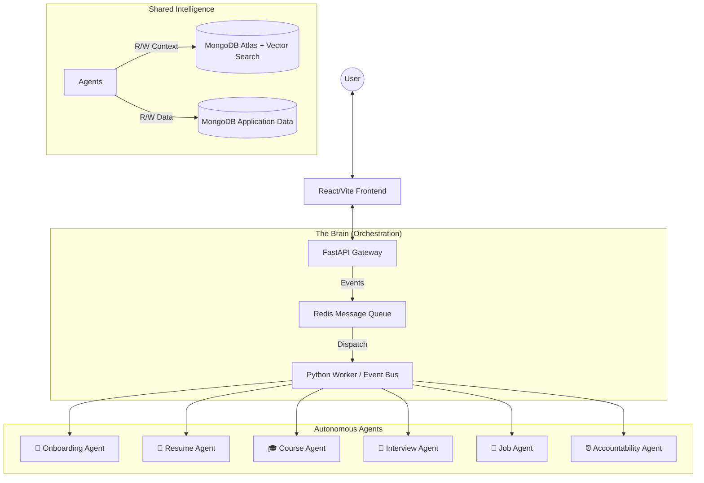

# Agentic Career Accelerator - System Architecture "Master Plan"

## 🌟 Executive Summary
We are building an **Autonomous Career Acceleration Ecosystem**, not just a set of tools. 
Unlike traditional platforms (which differ by *features*), our platform differs by **Agency**. 

**Our Agents don't just "respond"; they:**
1.  **Remember** (Shared Vector Memory)
2.  **Plan** (Long-term Career Roadmaps)
3.  **Collaborate** (Resume Agent tells Interview Agent what to focus on)
4.  **Act Proactively** (Accountability Agent nudges you when you slack off)

---

## 🏗️ High-Level System Architecture



---

## 🤖 The Agent Roster (Detailed Modules)

### 1. 👋 Onboarding Agent (The "Architect")
**Goal**: Understand the user's soul, not just their skills.
*   **Input**: Natural language conversation (not just forms).
*   **Role**:
    *   Assess **Learning Style** (Visual/Auditory/Text).
    *   Determine **Career Goals** (e.g., "Google Backend Role in 6 months").
    *   Assess **Current Level** (Quiz/Code snippet).
*   **Output**: Creates the initial `User Profile` and `Career Roadmap`.

### 2. 📄 Resume Agent (The "Analyst")
**Goal**: Turn a static document into a dynamic data source.
*   **Input**: PDF/Docx Resume.
*   **Role**:
    *   **Parses** skills, project complexities, and gaps.
    *   **Scores** against target Job Descriptions (ATS Score).
    *   **Identifies Gaps**: "You want a Backend role but lack Docker experience."
*   **Connection**: *Tells the **Course Agent** to generate a "Docker for Beginners" module.*

### 3. 🎓 Course Agent (The "Teacher")
**Goal**: Dynamic, adaptive, infinite learning.
*   **Capabilities**:
    *   **Generates Content**: Uses **Gemini 1.5 Flash** (high quality) for text/code.
    *   **Adaptation**: If User fails a quiz on "Recursion", it generates a *simpler* explanation with new analogies.
    *   **Modes**: 
        *   📖 **Read** (Text + Diagrams)
        *   🎧 **Listen** (TTS Audio Generation)
        *   💻 **Practice** (Judge0 Code Sandbox)

### 4. 🎤 Interview Agent (The "Coach")
**Goal**: Real-time multi-modal feedback.
*   **Inputs**: Webcam (Face), Mic (Voice), Transcript (Text).
*   **Technology**:
    *   **Vision**: MediaPipe (Gaze/Pose) + Mini-Xception (Emotion) -> *Confidence Score*.
    *   **Voice**: generic 1D-CNN (Tone/Shakiness) -> *Nervousness Score*.
    *   **Content**: **Llama 3.1 70B** (Groq) -> *Answer Quality Score*.
*   **Connection**: *Retrieves "Weak Areas" from Memory to ask targeted follow-up questions.*

### 5. ⏰ Accountability Agent (The "Mother")
**Goal**: Ensure completion.
*   **Trigger**: Time-based (Cron jobs).
*   **Role**:
    *   "You haven't studied 'System Design' yet, and your interview is Tuesday."
    *   Sends email/push notifications.

---

## 🧠 Shared Memory Architecture (The "Secret Sauce")

Agents must **know** what others know. We use **MongoDB Vector Search**.

**Structure**: `agent_memory` collection.
```json
{
  "user_id": "123",
  "memory_type": "skill_gap", 
  "content": "User struggled to explain ACID properties in DBs",
  "source_agent": "interview_agent",
  "embedding": [0.12, -0.45, ...], // Vector for semantic search
  "timestamp": 2024-12-21
}
```

**Example Flow**:
1.  **Interview Agent** logs: "User failed ACID question."
2.  **Course Agent** (next login): Vector searches "User weaknesses".
3.  **Result**: "Found gap: ACID properties."
4.  **Action**: Course Agent auto-generates a "Database Fundamentals" refresher chapter.

---

## 🛠️ The Tech Stack (Free & Powerful)

We have optimized for **$0 Cost** while maintaining **Enterprise Speed**.

| Component | Technology | Why? |
|-----------|------------|------|
| **Frontend** | React + Vite + Tailwind | Fast, modern, responsive. |
| **Backend** | FastAPI (Python) | Async, high-performance, ML-friendly. |
| **Database** | **MongoDB Atlas** (Free Tier) | 512MB storage, Vector Search built-in. |
| **LLM Inference** | **Groq** (Llama 3.1 70B) | ⚡ 500 tokens/sec (Fastest chat). |
| **GenAI** | **Gemini 1.5 Flash** | High context window (Courses/Long text). |
| **Voice AI** | **Whisper** (Self-Hosted) | Unlimited Speech-to-Text. |
| **Code Exec** | **Judge0** (Self-Hosted) | Unlimited Code Sandbox. |
| **Events** | Redis + Python Worker | Async task handling. |

---

## 🚀 Presentation Strategy for Team
"We are moving from a **Tool-based** platform (User uses Tool X) to an **Agent-based** platform (Agent X helps User)."

*   **Slide 1**: The Vision (Agentic vs. Static).
*   **Slide 2**: The Ecosystem Diagram (User at center).
*   **Slide 3**: The Cost Advantage ($0 Free Tier Stack).
*   **Slide 4**: The "Killer Feature" (Real-time ML Interview Coach).
